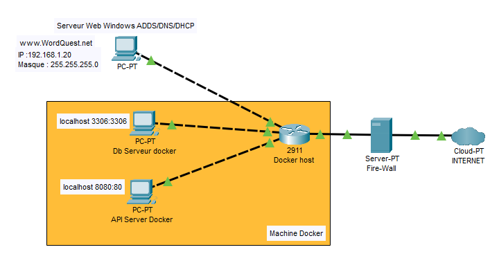

# WordQuest
Explorez, apprenez, dominez avec WordQuest : votre aventure vers l'anglais parfait !

*Explore, learn, dominate with WordQuest: your journey to perfect English!*
 
 ## Sommaire : 
- [Charte du projet](#charte-du-projet)
- [Fonctionnalités](#fonctionnalités)
- [Stack et Technologies](#stack-et-technologies)
- [Planning Prévisionnel](#planning-prévisionnel)
- [Pilotage du projet](#pilotage-du-projet)
- [Annexes](#annexes)

## Charte du projet
-   ### Description du Projet

WordQuest est une application d'apprentissage de vocabulaire conçue pour vous aider à enrichir votre vocabulaire anglais de manière ludique et interactive. Que vous soyez un débutant en anglais ou que vous cherchiez à améliorer vos compétences linguistiques, WordQuest offre une expérience d'apprentissage engageante adaptée à tous les niveaux.

*WordQuest is a vocabulary learning application designed to help you enrich your English vocabulary in a fun and interactive way. Whether you are a beginner in English or looking to improve your language skills, WordQuest offers an engaging learning experience suitable for all levels.*

Avec WordQuest, explorez un monde virtuel rempli de défis linguistiques et de quêtes captivantes. Parcourez différents niveaux et zones thématiques, où chaque étape vous propose une série de mots à apprendre et à maîtriser.Texte en bleu

*With WordQuest, explore a virtual world filled with linguistic challenges and captivating quests. Navigate through different levels and thematic areas, where each step presents you with a series of words to learn and master.*

-   ### Objectifs
    -   Rendre l'apprentissage du vocabulaire amusant et interactif.
    -   Augmenter le niveau de vocabulaire des utilisateurs de manière significative en 3 mois.
    -   Fournir des outils de suivi de progression pour les utilisateurs et les enseignants.
    -   Créer une communauté d'apprenants où les utilisateurs peuvent s'entraider et se challenger.

-   ### Membres du groupe :
    -    Thomas BATAILLE
    -    Julie KREUWEN

## Fonctionnalités
-   ### Fonctionnalités minimales
    -   Connexion Sécurisée
    -   API fonctionnelle
    -   Visualisation du niveau par mot
 
-   ### Fonctionnalités optimales
    -   Création et Gestion de Groupes
    -   Ajout de Cours (de listes de mots)
    -   Niveaux d'Apprentissage par Mots
    
-   ### Fonctionnalités optionnelles (dans l'ordre des priorités)
    -   Suivi de Progression (xp avec évolution hebdommadaire, mensuelle)
    -   Système de classement (mensuel, hebdomadaire; général ou de groupe) + récompense virtuelle associée
    -   Système d'abonnement
    -   Ajout de phrases

## Stack et Technologies

-   ### Langages de Programmation
    -   C# : développement de l'API
    - JavaScript : développement front-end et lien entre HTML et API

-   ### Frameworks et Bibliothèques
    -   APS.NET Core 8 : Framework utilisé pour l'API C#
    -   Swagger : documentation et debugging de l'API
    (-   React : si besoin)

-   ### Outils de Développement
    -   Visual Studio Code
    -   Git
    -   GitHub

-   ### Base de Données
    -   MySQL
    -   XAMPP : pour déployer la base de donnée en local lors du développement

-   ### Infrastructure
    -   Serveur Windows avec IIS : pour héberger l'API ASP.NET Core et la base de donnée MySQL
    -   Serveur AD DS

-   ### Services et API Tiers
    -   Stripe : gestions des paiement pour les abonnements
 
 ## Planning Prévisionnel
| Semaine        | Infrastructure                                                                                        | Développement                                                              |
| -------------- | ----------------------------------------------------------------------------------------------------- | -------------------------------------------------------------------------- |
| 29/04 au 05/05 | Recherche et choix des technologies                                                                   | Recherche et choix des technologies                                        |
| 06/05 au 12/05 | Schématisation du réseau et mise en place du serveur web                                              | Schématisation de la base de donnée                                        |
| 13/05 au 19/05 | Mise en place du + DHCP et de l'AD DS                                                                 | Création de la base de donnée                                              |
| 20/05 au 26/05 | Mise en place du serveur IIS et certifications pour le https                                          | Recherche sur la mise en place d'une API ASP.NET et schéatisation de l'API |
| 27/05 au 02/06 | Documentation du serveur                                                                              | Mise en place de l'API et debug                                            |
| 03/06 au 09/06 | Utilisation de Docker pour la base de donnée                                                          | Mise en place des fonctionnalités de l'application web                     |
| 10/06 au 14/06 | Debug                                                                                                 | Debug                                           |

-   ### Rendu + Oral le 14/06

 ## Pilotage du Projet
 https://github.com/users/kjuliek/projects/2

 ## Annexes
 -  ### Structure de la DataBase
 
 -  ### Diagramme de l'API 
 
-  ### Schéma de l'infrastructure
 

 

