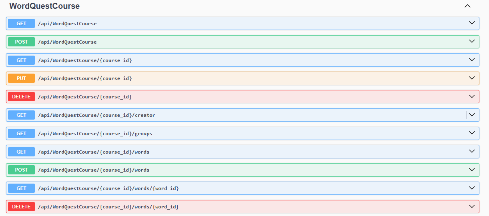
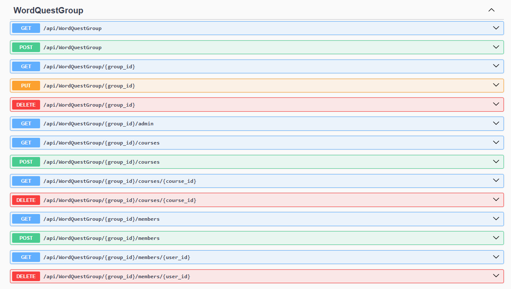
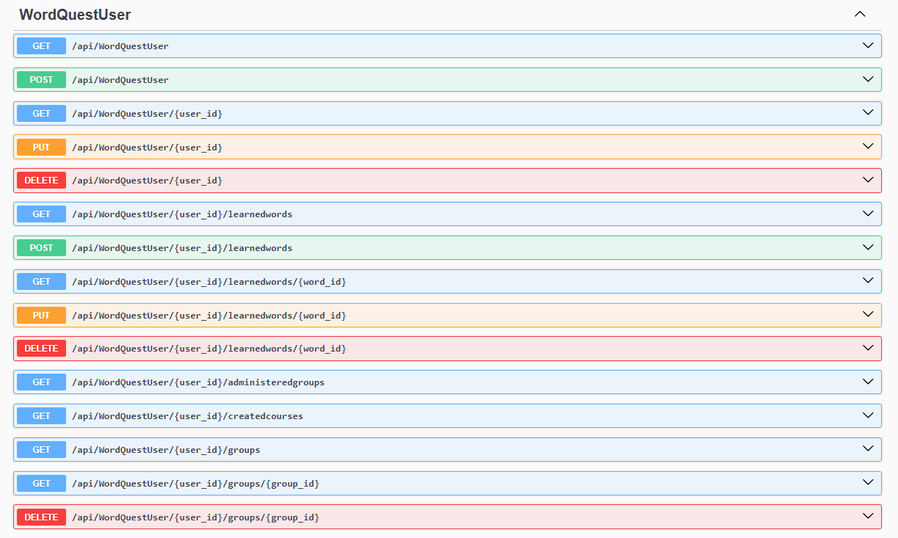
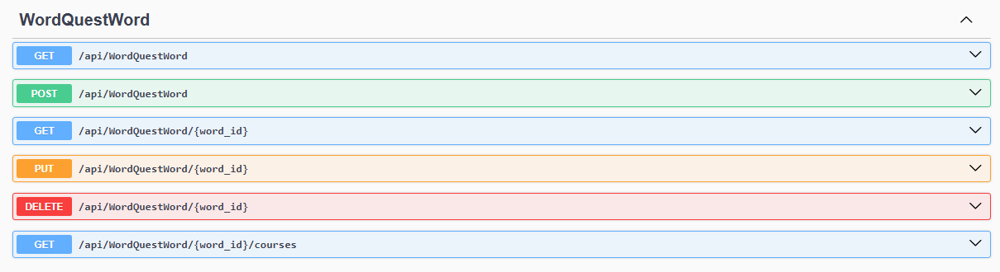

# WordQuest
Explorez, apprenez, dominez avec WordQuest : votre aventure vers l'anglais parfait !

*Explore, learn, dominate with WordQuest: your journey to perfect English!*

<!-- Sommaire -->
## Sommaire
-   [Installations Nécessaires](#installations-nécessaires)
-   [Création du Projet ASP.NET Core 8](#création-du-projet-aspnet-core-8-pour-lapi)
-   [Installations des Machines Virtuelles](#installations-des-machines-virtuelles)
-   [Lancer du projet](#lancer-le-projet)

<!-- /Sommaire -->

## Installations Nécessaires

## Création du Projet ASP.NET Core 8 pour l'API

L'ensemble de ces fonctions doivent s'afficher sur la page http://localhost:5094/swagger/index.html

dotnet add package Microsoft.AspNetCore.Authentication.Cookies
dotnet add package Microsoft.AspNetCore.Identity

## Installations des Machines Virtuelles
 
## Lancer le projet

