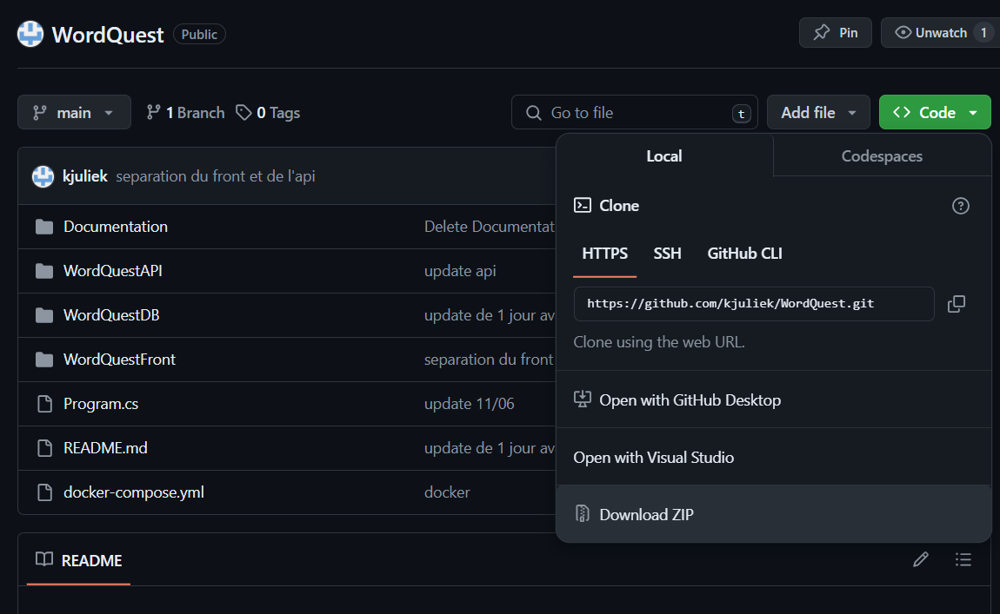

# WordQuest
Explorez, apprenez, dominez avec WordQuest : votre aventure vers l'anglais parfait !

*Explore, learn, dominate with WordQuest: your journey to perfect English!*

<!-- Sommaire -->
## Sommaire
-   [Installations Nécessaires](#installations-nécessaires)
-   [Préparation du Projet ASP.NET Core 8](#création-du-projet-aspnet-core-8-pour-lapi)
-   [Installations des Machines Virtuelles](#installations-des-machines-virtuelles)
-   [Configuration des IP dans l'API](#configuration-des-ip-dans-lapi)
-   [Lancer du projet](#lancer-le-projet)

<!-- /Sommaire -->

## Installations Nécessaires
 - Visual Studio Code

 ### Pour un lancement du projet en local :
 - XAMPP

Dans Visual Studio Code on installe les packages : Live Server et MySQL

## Lancement du Projet ASP.NET Core 8 pour l'API
### Télécharger le dossier WordQuest :

### Ouvrir le dossier WordQuest dans VS Code :

### Afin de reconstruire les fichiers générés par le compilateur et les outils de build, dans le terminal lancer les commandes suivantes :

    - cd .\WordQuestAPI\
    - dotnet restore
    - dotnet build

### Les dossiers bin et obj sont maintenant visibles dans WordQuestAPI :

## Lancement en local

Cette partie n'est utile que si vous souhaitez lancer le projet en local, sinon allez directement à la partie : [Installations des Machines Virtuelles](#installations-des-machines-virtuelles)

### Lancer un serveur MySQL sur XAMPP 

### Initialiser la base de donnée MySQL
avec les paramètres : 
- base de donnée : "wordquest"
- port : "3306"
- utilisateur : "root"
- mot de passe : ""

### Lancer les commandes suivantes dans le terminal
    - cd .\WordQuestAPI\ (pas nécessaire si vous êtes déjà dans le fichier)
    - dotnet ef database update

### Ouvrir le fichier /WordQuestFront/index.html et cliquer sur le bouton GoLive en bas de l'écran

### On a donc le port du serveur Front qui s'affiche ici c'est "http:/127.0.0.1:5501"

## Installations des Machines Virtuelles
Cette partie n'est utile pas utile si vous souhaitez lancer le projet en local, si c'est le cas allez directement à la partie : [Configuration des IP dans l'API](#configuration-des-ip-dans-lapi)

Mettre le doc Machine virtuel ici

## Configuration des IP dans l'API
### Dans le fichier /WodQuestAPI/Models/Startup.cs modifier l'adresse par l'adresse du serveur Front

### Dans le fichier /WodQuestAPI/Properties/launchSettings.json modifier les adresses par l'adresse du serveur API correspondantes

## Lancer le projet

### Lancer les commandes suivantes :
    - cd .\WordQuestAPI\ (pas nécessaire si vous êtes déjà dans WordQuestAPI)
    - dotnet run

